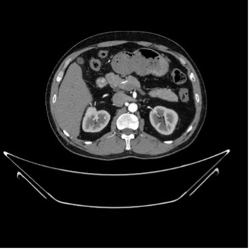

# TransConvNet: Enhancing Kidney Abnormality Detection in CT Imaging through Hybrid Transformer-CNN Model with Integrated Explainability

**Author:** Mohamedalfateh T. M. Saeed

## Table of Contents
1. [Introduction and Literature Review](#introduction-and-literature-review)
2. [Datasets](#datasets)
   - 2.1. [CT Kidney Dataset: Normal-Cyst-Tumor and Stone](#ct-kidney-dataset-normal-cyst-tumor-and-stone)
   - 2.2. [Kidney Stone Detection Dataset](#kidney-stone-detection-dataset)
3. [Technologies](#technologies)
   - 3.1. [Neural Networks](#neural-networks)
   - 3.2. [Transformer](#transformer)
   - 3.3. [Hybrid Model (Neural Networks and Transformers)](#hybrid-model-neural-networks-and-transformers)
   - 3.4. [Explainable AI](#explainable-ai)
4. [References](#references)

## Introduction and Literature Review

Abdominal pain constitutes a significant proportion of the reasons for admission to the emergency department. The abdominal cavity contains a diverse range of organ structures, implying a diverse range of disease causes. The first step to diagnosing the pain in the emergency department is radiological imaging. Radiological imaging tests are frequently used to confirm or exclude a suspected condition and to narrow the differential diagnosis list. Advancements in medical imaging technology, particularly in computed tomography (CT), have revolutionized the diagnosis and management of kidney abnormalities. With the growing incidence of renal disorders worldwide, there is an increasing demand for accurate and efficient detection methods. In response to this need, researchers have leveraged the power of deep learning algorithms to develop sophisticated models capable of analyzing CT images for the detection of kidney stones, cysts, tumors, and other anomalies.

Parakh et al. [1] proposed a cascade CNN model, CNN-1 to determine the range of the urinary tract and CNN-2 to detect the stones. The study was conducted on 535 combined CT images, 100 for testing and 435 for training. It is worth mentioning that ImageNet and GrayNet(built-in datasets) have been used as pertained datasets. The proposed models produced a percentage of accuracy of 95% with GrayNet and 91% with ImageNet.
 
In the method proposed at [2], the authors employed a cross-residual network (XResNet-50) for kidney stone detection. A different cross-sectional CT image dataset consists of a total of 1799 images, which have been used. Their approach reaches an accuracy of 96.82% for both large and small-sized kidney stones.

The authors in [3] developed a comprehensive dataset named "CT KIDNEY DATASET: Normal-Cyst-Tumor and Stone," which consists of 12,446 annotated CT images. This dataset includes images of kidney stones, cysts, tumors, and normal kidneys. The study implemented six machine learning models, including three state-of-the-art Vision Transformers (EANet, CCT, and Swin transformers) and three well-known CNN-based models (VGG16, ResNet50, and Inception v3). These models were fine-tuned and evaluated for their performance in detecting kidney abnormalities. Among the models tested, the Swin Transformer exhibited the highest accuracy, achieving an impressive accuracy of 99.30%. This model also outperformed others in terms of F1 score, precision, and recall. Furthermore, the study employed gradient-weighted class activation mapping (Grad-CAM) to visualize and interpret the decisions made by the CNN models, particularly VGG16, ResNet50, and Inception v3.

In their study [4] authors present a deep learning-based detection and prediction model for kidney diseases, specifically targeting the identification of kidney cysts and stones using the YOLO architecture. The study utilized CT images categorized into three classes: 72 kidney cysts, 394 kidney stones, and 192 healthy kidneys. The YOLOv7 architecture, supported by explainable artificial intelligence (xAI), outperformed the YOLOv7 Tiny design in the performance analysis. The results demonstrated a high level of accuracy with a mean Average Precision (mAP50) of 0.85, a precision of 0.882, sensitivity of 0.829, and an F1 score of 0.854. This model highlights the potential of integrating xAI with deep learning to enhance diagnostic accuracy and provide insights into the decision-making process of AI systems.
In [5] authors introduced a CNN-based hybrid model for classifying kidney CT images. Their model utilizes a combination of convolutional layers, batch normalization, and max-pooling for feature extraction. A distinctive feature of this model is its approach to feature extraction and optimization. Features obtained from the 6th and 7th convolution layers are combined, with the 6th layer providing a feature map of size 12,446×384 and the 7th layer providing a map of size 12,446×256. The best 200 features from these maps are selected using the relief dimension reduction method, resulting in an optimized feature map of size 12,446×400. This optimized feature map is then classified using a wide neural network. This optimization improved classification accuracy to an impressive 99.37%, surpassing eight established models (including InceptionV3 at 87.75%)
In  [6] authors Sagar Dhanraj Pande and Raghav Agarwal present an AI-based system utilizing the YOLOv8 model for detecting various kidney abnormalities in CT images. Addressing the global shortage of nephrologists, the authors aim to improve early detection of chronic kidney disease (CKD) and other renal issues such as cysts, stones, and tumors. They compiled a dataset of 12,446 annotated CT images from hospitals in Dhaka to train the model. Utilizing YOLOv8 for its real-time object detection capabilities, the model achieved an accuracy of 82.52%, precision of 85.76%, recall of 75.28%, F1 score of 75.72%, and specificity of 93.12%.
In this study [7] CT KIDNEY DATASET has been exploited in the diagnosis and detection of kidney tumors, cysts, and stones using CT images. Initial preprocessing steps involve noise reduction to enhance image quality, followed by advanced segmentation techniques such as Otsu’s binarization, Distance transform, and watershed transformation to accurately delineate regions of interest. Contour feature extraction is performed to further aid in recognizing subtle differences in kidney conditions. Multiple deep learning models—DenseNet201, EfficientNetB0, InceptionResNetV2, MobileNetV2, ResNet50V2, and Xception—are trained using three optimizers: RMSprop, SGD, and Adam. These models are evaluated based on various performance metrics, including accuracy, precision, recall, root mean square error (RMSE), and F1 score. Key findings highlight the exceptional performance of the Xception model, which achieved an accuracy of 99.89% when used with the RMSprop optimizer. Other models like ResNet50V2 and DenseNet201 also demonstrated impressive accuracies of 99.68% with SGD and Adam optimizers, respectively. However, MobileNetV2 exhibited significant overfitting, indicating challenges in generalizing to unseen data.
In conclusion, while some studies have employed sophisticated deep learning architectures and transfer learning to achieve high accuracy in classifying kidney abnormalities such as cysts, stones, tumors, and normal conditions, certain limitations persist. Despite the integration of transformers to enhance accuracy and the adoption of Explainable AI (xAI) to justify AI classification decisions and foster trust between this technology and medical practitioners and achieving impressive accuracies on specific datasets, the models may struggle to perform consistently across varied imaging protocols, patient demographics, and disease manifestations.

In response to these limitations, a novel method is proposed: the Hybrid Transformer-CNN Model with Integrated Explainability. This approach leverages the complementary strengths of transformer-based models and convolutional neural networks to enhance classification performance and generalization across diverse datasets. By integrating explainability mechanisms directly into the model architecture, the proposed method ensures transparency and interpretability without relying on external visualization tools.

## Datasets
A diagnostic radiologist's essential role is to analyze and interpret medical images. [8], the large number of patients in the emergency department cause shortage of radiologist. In addition, using a computer-aided diagnosis system will minimize physician-induced errors. Each year, kidney cancer affects over 430,000 people, leading to approximately 180,000 fatalities [9]. The incidence of kidney tumors surpasses this number, yet current radiographic techniques often cannot distinguish between malignant and benign tumors [10] . Furthermore, a significant proportion of presumed malignant tumors exhibit slow growth and indolent behavior, prompting the adoption of "active surveillance" as a preferred management approach for small renal masses [11].

The primary aim of this project is to alleviate the workload of healthcare professionals by implementing an accurate classification system for kidney cases across four distinct clinical conditions (Cyst, Normal, Stone, Tumor). By precisely categorizing cases into these clinical conditions, and providing a justification of the decision made, the project endeavors to streamline diagnosis and treatment processes, ultimately contributing to improved patient care and outcomes.

Medical datasets, particularly Computerized Tomography (CT) datasets, frequently face issues of scarcity, and a significant number are not publicly accessible. However, the contribution by the authors in [3] is noteworthy, as they have made their “CT KIDNEY DATASET: Normal-Cyst-Tumor and Stone” publicly available on Kaggle, thus enabling further research and development in this field. This study will primarily utilize this dataset to train the proposed method. Additionally, it is important to acknowledge the authors in [2] for introducing the “Kidney_stone_detection” dataset, which is publicly available on GitHub. This dataset will be employed to validate the generalizability of our model.

### CT Kidney Dataset: Normal-Cyst-Tumor and Stone

The CT images were collected from the Picture Archiving and Communication System (PACS) of several hospitals in Dhaka, Bangladesh [3]. The dataset includes both contrast and non-contrast studies of the whole abdomen and urogram in both coronal and axial cuts. The researchers carefully selected DICOM studies containing confirmed diagnoses of kidney cysts, stones, normal findings, or tumors. They then created batches of DICOM images for each region of interest (ROI) associated with a specific radiological finding. Patient information and metadata were subsequently removed from the DICOM images before conversion to a lossless JPG format. The dataset consists of 12,446 CT scan images categorized into four classes. Table 1 presents the distribution of image categories in the CT Kidney Dataset, while Figure 1 illustrates sample images from the dataset.

***Table 1: Distribution of Images in the CT Kidney Dataset***
|Category|Number of Images|
|--------|----------------|
|Cyst|	3,709|
|Normal	|5,077|
|Stone	|1,377|
|Tumor|	2,283|

 
- Cyst

- Normal

- Stone

- Tumor

***Figure 1: CT KIDNEY DATASET Sample***

### Kidney Stone Detection Dataset
This study [2] received approval from the ethics committee of Fırat University, Turkey. Five hundred NCCT images were collected from patients diagnosed with urinary system stone disease at Elazığ Fethi Sekin City Hospital, Turkey. The images were acquired in the supine position using a Philips Healthcare Ingenuity Elite scanner without contrast administration. The dataset and code are publicly available at GitHub

Patient personal information was excluded from the dataset. Coronal CT sections (CT protocol: 120 kV; auto tube current: 100 mA–200 mA; 128 mm detector; mAs: 203; slice thickness: 5 mm) were labeled by a radiologist and a urologist as containing stones or not, without segmentation. Patients aged 18 to 80 years were included, excluding those with double-J ureteral catheters, under 18 or over 80 years, single kidneys, kidney anomalies, or atrophic kidneys.

The dataset comprised 433 subjects: 278 with kidney stones (790 images) and 165 without stones (1009 images). Subjects used for training and validation were different from those used for testing to avoid bias. Figures 1 and 2 show CT images for training, validation, and testing, including normal and kidney stone examples obtained through augmentation techniques. Table 2 presents the distribution of image categories in the Kidney Stone Detection Dataset, while Figure 2 illustrates sample images from the dataset.

***Table 2: The distribution of image categories in the Kidney Stone Detection Dataset***
|Category|	Number of Images|
|--------|------------------|
|Normal	|790|
|Stone	|1009|

 - Stone  - Normal

***Figure 2: Kidney Stone Detection Dataset sample***

## Technologies

### Neural Networks
Neural networks are a class of machine learning algorithms inspired by the structure and function of the human brain. They consist of interconnected layers of nodes, or "neurons," that process data in complex ways to recognize patterns and make predictions. Neural networks are particularly effective in handling large volumes of structured and unstructured data, making them suitable for various applications in medical imaging and healthcare diagnostics [12] [13] [14].

One prominent application of neural networks is in medical imaging for disease detection and classification. For instance, deep neural networks (DNNs) have shown significant promise in detecting osteosarcoma cells from H&E-stained images. These networks can differentiate between normal and diseased cells with high accuracy, outperforming traditional models like AlexNet, LeNet, and VGGNet. By leveraging large datasets, DNNs provide robust diagnostic tools that aid in clinical decision-making, especially in remote healthcare settings [12].

In emergency medicine, neural networks are used to predict 72-hour return admissions to emergency departments. Combining structured data, such as medical history and vitals, with unstructured data from physicians' notes, these models enhance the accuracy of readmission predictions. This integration addresses gaps in previous research that often overlooked the potential of unstructured data and short-term readmissions [13].

Additionally, neural networks are employed in diagnosing a range of diseases, including lung and eye conditions. Advanced architectures like ResNet-50, Inception V3, and VGG-16 have been used to classify, detect, and segment medical images, achieving high accuracy rates. These models support the early detection and treatment of diseases, improving patient outcomes and advancing the capabilities of telemedicine and virtual healthcare systems [14].

In conclusion, neural networks are a transformative technology in healthcare, offering precise and efficient diagnostic capabilities. Their ability to process complex medical data and integrate multiple data sources makes them invaluable in modern medical practices. Future advancements in neural networks and deep learning will continue to enhance their application in remote healthcare, virtual hospitals, and beyond.

### Transformer
In recent years, artificial intelligence (AI) has significantly advanced, particularly with the advent of deep learning models like Convolutional Neural Networks (CNNs) and Transformers. These models have shown remarkable success across various domains, including medical imaging. Our project, "TransConvNet: Enhancing Kidney Abnormality Detection in CT Imaging through Hybrid Transformer-CNN Model with Integrated Explainability," aims to harness the power of both CNNs and Transformers to improve the detection of kidney abnormalities in CT scans. This technology review will explore the role of Transformers in medical imaging, emphasizing their relevance and potential contributions to our project.

Transformers, introduced by Vaswani et al. in 2017, revolutionized natural language processing by utilizing a self-attention mechanism that enables the model to capture long-range dependencies within data. This innovation has since been adapted to computer vision, giving rise to Vision Transformers (ViTs). Transformers are designed to handle sequence-to-sequence tasks by focusing on the relationships between different parts of the input data, making them highly effective for tasks requiring context understanding over long distances within the data [15].

Transformers are characterized by several key features. The self-attention mechanism allows the model to weigh the importance of different input parts, enabling it to capture global context. Transformers are highly scalable, allowing for training on large datasets with increased computational resources. Additionally, their versatility means they can be applied to various tasks, including image classification, object detection, segmentation, and more.

In medical imaging, Transformers have been increasingly applied for tasks such as segmentation, classification, detection, and reconstruction. For example, they are used to delineate structures like organs and tumors in imaging data, diagnose diseases based on imaging data, identify specific abnormalities or features within images, and improve image quality or generate new imaging data from existing samples. Table 3 provides a comprehensive comparison between Neural Networks (CNNs) and Transformers in Healthcare.

***Table 3: Comparison of Neural Networks (CNNs) and Transformers in Healthcare***
| Aspect              | Neural Networks (CNNs)                                                                                                                                                                          | Transformers                                                                                                                                                  |
|---------------------|-------------------------------------------------------------------------------------------------------------------------------------------------------------------------------------------------|---------------------------------------------------------------------------------------------------------------------------------------------------------------|
| General Description | CNNs are a type of deep learning model particularly well-suited for image analysis due to their ability to capture spatial hierarchies through convolution operations.                                   | Transformers, originally designed for natural language processing, have been adapted for image analysis. They leverage self-attention mechanisms to process data in parallel, capturing global context more effectively. |
| Healthcare Applications | CNNs have been extensively used in medical image processing, including detecting kidney abnormalities, segmenting organs, and classifying diseases.                                        | Transformers are emerging in medical imaging, offering improvements in capturing long-range dependencies in data, which can enhance tasks like image classification, segmentation, and anomaly detection.   |
| Strengths           | • Excellent at capturing local features and spatial hierarchies.                                                                                                                                 | • Superior in capturing global context due to self-attention mechanisms.                                                                                      |
|                     | • Highly efficient for image data with well-defined local structures.                                                                                                                          | • More flexible in handling varied data types and tasks.                                                                                                      |
|                     | • Proven track record in various medical imaging tasks.                                                                                                                                         | • Can process entire images at once, potentially improving accuracy and efficiency.                                                                            |
| Weaknesses          | • Limited in capturing long-range dependencies due to localized receptive fields.                                                                                                             | • Computationally intensive, especially for high-resolution images.                                                                                           |
|                     | • May require large amounts of annotated data for training.                                                                                                                                    | • Require large datasets and significant computational resources.                                                                                              |
|                     | • Prone to issues with vanishing/exploding gradients in very deep architectures.                                                                                                               | • Relatively new in medical imaging, with fewer established applications compared to CNNs.                                                                     |
| Explainability      | • Techniques like Grad-CAM and saliency maps help visualize which parts of the image are influencing the model's decision.                                                                    | • Self-attention maps provide some level of interpretability by showing the importance of different parts of the input.                                          |
|                     | • Explainability methods are well-established but can be computationally expensive.                                                                                                            | • Research on explainability is ongoing, with potential for improved visualization of decision-making processes.                                                |

### Hybrid Model (Neural Networks and Transformers)

Transformers and CNNs, each has distinct strengths and weaknesses. Transformers excel at capturing long-range dependencies and contextual understanding, and they tend to perform better in tasks requiring comprehensive understanding of the input data. However, they require large amounts of data and computational resources, and they can be more complex to implement, and tune compared to CNNs. On the other hand, CNNs are highly efficient at local feature extraction with lower computational costs, and they are well-established and widely used in medical imaging applications. However, CNNs are limited in capturing global context due to local receptive fields and can act as black-box models with less interpretability.

Transformers are particularly relevant to our project for several reasons. The self-attention mechanism in Transformers can capture complex relationships and dependencies within CT images, potentially leading to more accurate detection of kidney abnormalities. By combining Transformers with CNNs, we can leverage the strengths of both models—CNNs for local feature extraction and Transformers for global context understanding. Additionally, Transformers' attention maps can provide insights into which parts of the image the model focuses on, enhancing the interpretability of the detection results.

### Explainable AI

Transformers, initially popularized in natural language processing, have shown remarkable success in computer vision tasks due to their ability to capture long-range dependencies and global context. In medical imaging, Transformers have been applied to various tasks such as segmentation, classification, detection, reconstruction, and clinical report generation [15]. Their key features include self-attention mechanisms and the capability to handle large-scale data efficiently.

Explainable AI (EXAI) is a transformative approach that enhances the interpretability of AI models. In healthcare, EXAI is essential for ensuring that AI-driven decisions are transparent and trustworthy. This is particularly important in clinical settings where understanding the rationale behind a model's prediction can influence treatment decisions. EXAI techniques involve feature extraction and model behavior analysis to provide insights into the decision-making process [16].

The integration of Transformers and EXAI in the TransConvNet project is crucial for several reasons. Transformers can address the challenge of capturing complex patterns in CT images of kidneys, which is essential for accurate abnormality detection. EXAI will ensure that the model's predictions are interpretable, thus fostering trust among clinicians and aiding in decision-making processes. This hybrid approach can improve diagnostic accuracy and provide detailed explanations for each prediction, enhancing the overall reliability of the system.

In [3] the authors leveraged Explainable AI techniques with their CNN models, specifically Inception v3, Vgg16, and Resnet. The models achieved accuracies of 98.20%, 61.60%, and 73.80% for Vgg16, Inception v3, and Resnet, respectively. According to the results, it is evident that Vgg16 provided significantly better performance and justification compared to the other models, as depicted clearly in the accompanying figure 3 [3]. The advantage of using Explainable AI is particularly evident with Vgg16, which effectively highlighted the dependencies of its decisions using techniques like Grad-CAM. This not only enhanced transparency but also allowed healthcare professionals to understand and trust the model's decision-making process, ensuring accuracy and interpretability.

***Figure 3: GradCam analysis of kidney Cyst, Normal, Stone, and Tumor class photos***

The advantage of using Explainable AI is particularly evident with Vgg16, which effectively highlighted the dependencies of its decisions using techniques like Grad-CAM. This not only enhanced transparency but also allowed healthcare professionals to understand and trust the model's decision-making process, ensuring accuracy and interpretability.

## References

[1] 	A. L. H. L. J. H. E. B. H. S. D. V. &. D. S. Parakh, Urinary stone detection on CT images using deep convolutional neural networks: evaluation of model performance and generalization., Radiology: Artificial Intelligence, 1(4), e180066, 2019. 

[2] 	K. B. P. G. T. M. Y. O. K. M. &. A. U. R. Yildirim, Deep learning model for automated kidney stone detection using coronal., Computers in biology and medicine, 135, 104569.‏, 2021.

[3] 	M. N. H. M. H. M. K. A. M. G. R. U. M. Z. &. S. A. Islam, Vision transformer and explainable transfer learning models for auto detection of kidney cyst, stone and tumor from CT-radiography, vol. 12(1), Scientific Reports, 2022, pp. 1-14.

[4] 	A. F. G. C. B. A. &. K. H. Bayram, A detection and prediction model based on deep learning assisted by explainable artificial intelligence for kidney diseases, vol. 40, Avrupa Bilim ve Teknoloji Dergisi, 2022, pp. 67-74.

[5] 	H. Y. M. Y. K. &. A. B. Bingol, Bingol, H., Yildirim, M., Yildirim, K., & Alatas, B. (2023). Automatic classification of kidney CT images with relief based novel hybrid deep model, vol. 9, PeerJ Computer Science, 2023, p. e1717.

[6] 	S. D. &. A. R. Pande, Multi-class kidney abnormalities detecting novel system through computed tomography, IEEE Access, 2024. 

[7] 	Y. B. T. P. S. K. C. &. S. C. Kumar, A Comprehensive Study of Deep Learning Methods for Kidney Tumor, Cyst, and Stone Diagnostics and Detection Using CT Images, Archives of Computational Methods in Engineering, 2024, pp. 1-26.

[8] 	M. H. J. W. H. X. &. K. P. Hesamian, Deep learning techniques for medical image segmentation: achievements and challenges, Journal of digital imaging, 32, 582-596., 2019. 

[9] 	H. e. a. Sung, GLOBOCAN estimates of incidence and mortality worldwide for 36 cancers in 185 countries, : CA: a cancer journal for clinicians 71.3 209-249., 2020.

[10] 	A. D. &. P. I. de Leon, Imaging and screening of kidney cancer, Radiologic Clinics, 55(6), 1235-1250, 2017. 

[11] 	M. C. C. U. B. R. O. I. S. M. K. M. .. &. P. P. M. Mir, Role of active surveillance for localized small renal masses., European urology oncology, 1(3), 177-187., 2018. 

[12] 	B. P. P. &. D. D. Davazdahemami, A deep learning approach for predicting early bounce-backs to the emergency departments, Vols. , 2, 100018., Healthcare Analytics, 2022.

[13] 	P. K. S. P. K. S. S. N. V. P. M. J. T. &. G. M. Mall, A comprehensive review of deep neural networks for medical image processing: Recent developments and future opportunities, vol. 100216, Healthcare Analytics, 2023.

[14] 	S. N. Q. A. L. J. &. M. T. Iqbal, On the analyses of medical images using traditional machine learning techniques and convolutional neural networks, vol. 30(5), Archives of Computational Methods in Engineering, 2023, pp. 3173-3233.

[15] 	F. K. S. Z. S. W. K. M. H. H. M. K. F. S. &. F. H. Shamshad, Transformers in medical imaging: A survey, vol. 102802, Medical Image Analysis, 2023. 

